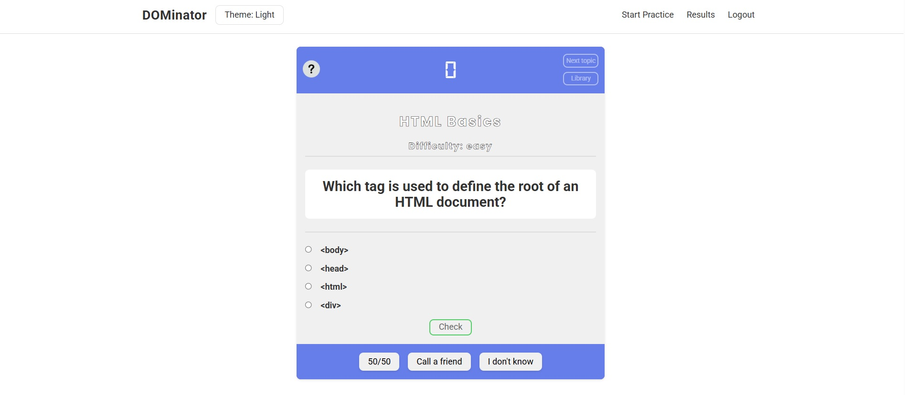
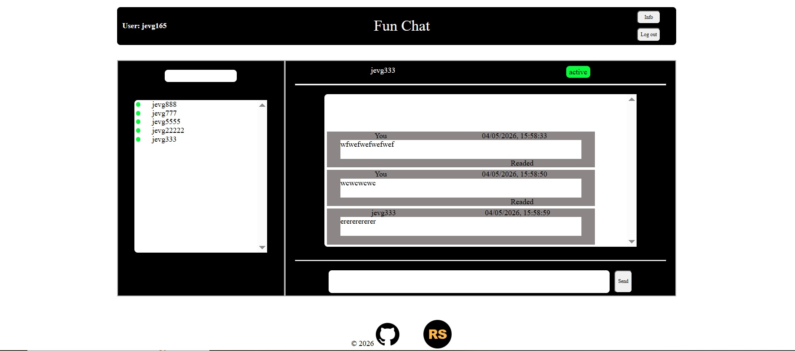
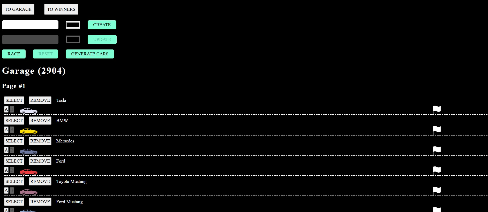
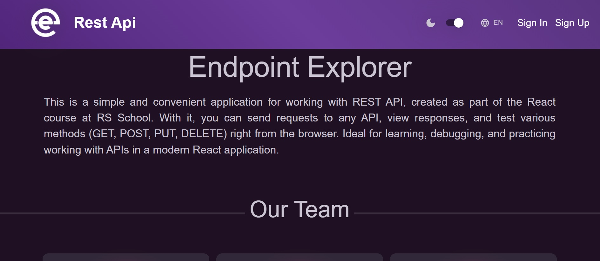
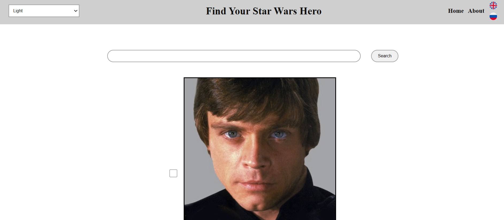

## 👋 Hello!

## ❗ My name is Jevgeni and I have a great interest in the field of web development and I hope that my desire to keep learning will help me become a demand full-stack developer.

**Courses:**

<table>
  <tr>
    <td>✔️</td><td> </td>
  </tr>

  <tr>
     <td>✔️</td><td></td>
  </tr>

  <tr>
    <td>✔️</td><td> </td>
  </tr>

  <tr>
    <td>✔️</td><td> </td>
  </tr>

 <tr>
 <td>✔️</td>
 <td>
  
</td>
</tr>

  <tr>
    <td>✔️</td><td> </td>
  </tr>
</table>

---

## 🏆 My achievements:

Graduated from the RS School Frontend Development program. Course schedule is available [here](https://github.com/rolling-scopes-school/js-fe-course-en).
Acted as a team lead for the final project, coordinating team efforts, managing workflow, and leading the project to a successful defense.

## 💻 I know how it works:

<section align="center">

</section>
&nbsp;

---

## 🚀 Now I am learning NODE JS and LLM application development

## Completed projects

 
Click image to try how it works</b>

---

<table align="center">
  <tr>
    <td>
      <a href="https://webis-2022-rs-tandem.netlify.app" target="_blank">
       <kbd></kbd>
      </a>
    </td>
    <td>
      📄 <b>"DOMinator"</b> the app (Typescript)  
      <a href="https://github.com/webis-2022/rs-tandem">Link to code</a>
    </td>
  </tr>

  <tr>
    <td>
      <a href="https://webis-2022-fun-chat.netlify.app" target="_blank">
       <kbd></kbd>
      </a>
    </td>
    <td>
      📄 <b>"Fun Chat"</b> the app (Typescript)  
      <a href="https://github.com/rolling-scopes-school/webis-2022-JSFE2025Q3/tree/fun-chat/fun-chat">Link to code</a>
    </td>
  </tr>

  <tr>
    <td>
      <a href="https://webis-2022-async-race.netlify.app" target="_blank">
       <kbd></kbd>
      </a>
    </td>
    <td>
      🎮 <b>"Async Race"</b> the game (Typescript)  
      <a href="https://github.com/rolling-scopes-school/webis-2022-JSFE2025Q3/tree/async-race/async-race">Link to code</a>
    </td>
  </tr>

  <tr>
    <td>
      <a href="https://rest-cli2.netlify.app/en/" target="_blank">
       <kbd></kbd>
      </a>
    </td>
    <td>
      📄 <b>"Endpoint Explorer"</b> the app (React)  
      <a href="https://github.com/SunSundr/rest-client-app/tree/develop">Link to code</a>
    </td>
  </tr>

  <tr>
    <td>
      <a href="https://react-2025-q3-f3l4de4al-jevgenis-projects-84ef6cde.vercel.app/" target="_blank">
       <kbd></kbd>
      </a>
    </td>
    <td>
      📄 <b>"Star Wars Hero"</b> the app (React)  
      <a href="https://github.com/webis-dev/REACT2025Q3/tree/nextjs-ssr">Link to code</a>
    </td>
  </tr>

  <tr>
    <td>
      <a href="https://webis-2022.github.io/simon-says/" target="_blank">
       <kbd></kbd>
      </a>
    </td>
    <td>
      🎮 <b>"Simon Says"</b> the game (Javascript)  
      <a href="https://github.com/Webis-2022/simon-says">Link to code</a>
    </td>
  </tr>

  <tr>
    <td>
      <a href="https://webis-2022.github.io/nonograms/" target="_blank">
       <kbd></kbd>
      </a>
    </td>
    <td>
      🎮 <b>"Nonograms"</b> the game (Javascript)  
      <a href="https://github.com/Webis-2022/nonograms">Link to code</a>
    </td>
  </tr>

  <tr>
    <td>
      <a href="https://rolling-scopes-school.github.io/webis-2022-JSFEPRESCHOOL2024Q2/image-gallery/" target="_blank" >
      <kbd></kbd>
      </a>
    </td>
    <td>
      📄 <b>"Image Gallery"</b> the application  
      <a href="https://github.com/rolling-scopes-school/webis-2022-JSFEPRESCHOOL2024Q2/tree/image-gallery/image-gallery">Link to code</a>
    </td>
  </tr>

  <tr>
    <td>
      <a href="https://rolling-scopes-school.github.io/webis-2022-JSFEPRESCHOOL2024Q2/shelter/" target="_blank" >
      <kbd></kbd>
      </a>
    </td>
    <td>
      📄 <b>"Shelter"</b> the website  
      <a href="https://github.com/rolling-scopes-school/webis-2022-JSFEPRESCHOOL2024Q2/tree/shelter-part3/shelter">Link to code</a>
    </td>
  </tr>

 <tr>
    <td>
       <a href="https://rolling-scopes-school.github.io/webis-2022-JSFE2024Q4/christmas-shop/" target="_blank">
       <kbd></kbd>
       </a>
   </td>
   <td>
      📄 <b>"Christmas Shop"</b> the e-store  
      <a href="https://github.com/rolling-scopes-school/webis-2022-JSFE2024Q4/tree/christmas-shop-part3/christmas-shop">Link to code</a>
    </td>
  </tr>

  <tr>
    <td>
       <a href="https://webis.ee/portfoolio/" target="_blank">
       <kbd></kbd>
       </a>
   </td>
   <td>
      🔗 <b>"Websites created on different CMS"</b>
      </td>
  </tr>
</table>

---
